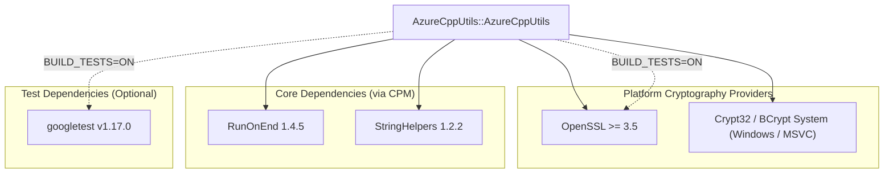

# Project Dependencies

This document is automatically generated from `CMakeLists.txt` files for `AzureCppUtils`.

## Dependency Diagram

## Dependency Breakdown

| Dependency | Repository / Target | Version | Type | Scope / Platform |
| :--- | :--- | :--- | :--- | :--- |
| **OpenSSL** | `System / OpenSSL` | >= 3.5 | `find_package` | Linux / macOS (GCC, Clang, AppleClang) |
| **Crypt32 / BCrypt** | `System / Win32` | System | `Win32 API` | Windows (MSVC) |
| **RunOnEnd** | [`siddiqsoft/RunOnEnd`](https://github.com/siddiqsoft/RunOnEnd) | 1.4.5 | `CPM` | All Platforms (`INTERFACE`) |
| **StringHelpers** | [`siddiqsoft/StringHelpers`](https://github.com/siddiqsoft/StringHelpers) | 1.2.2 | `CPM` | All Platforms (`INTERFACE`) |
| **OpenSSL** | `System / OpenSSL` | >= 3.5 | `find_package` | Test Target Only (`BUILD_TESTS=ON`) |
| **googletest** | [`google/googletest`](https://github.com/google/googletest) | v1.17.0 | `CPM` | Test Target Only (`BUILD_TESTS=ON`) |
